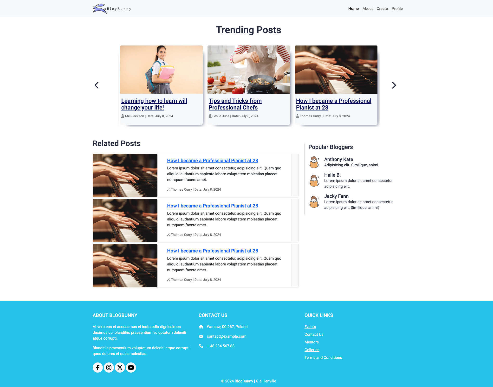
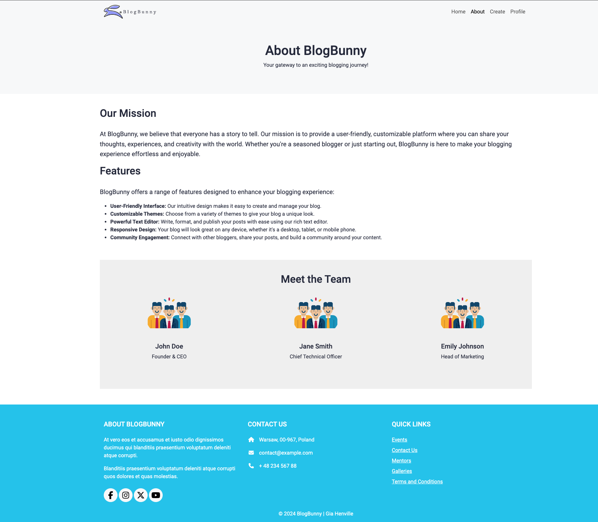
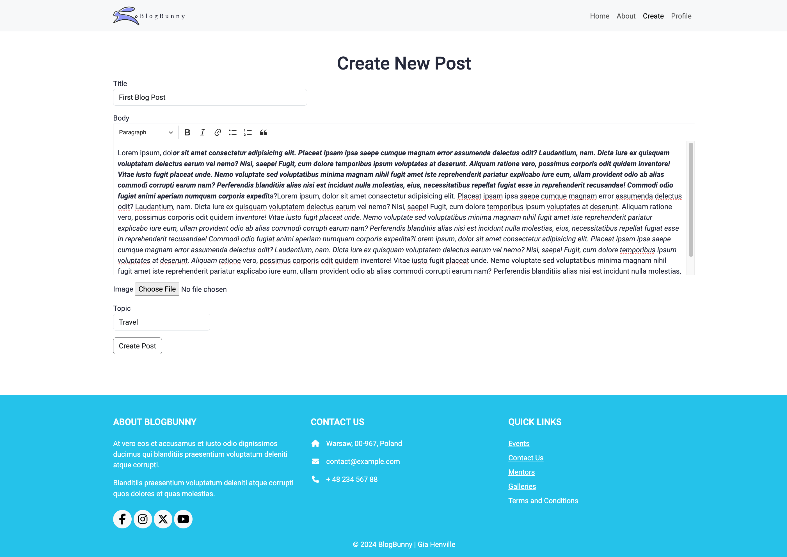
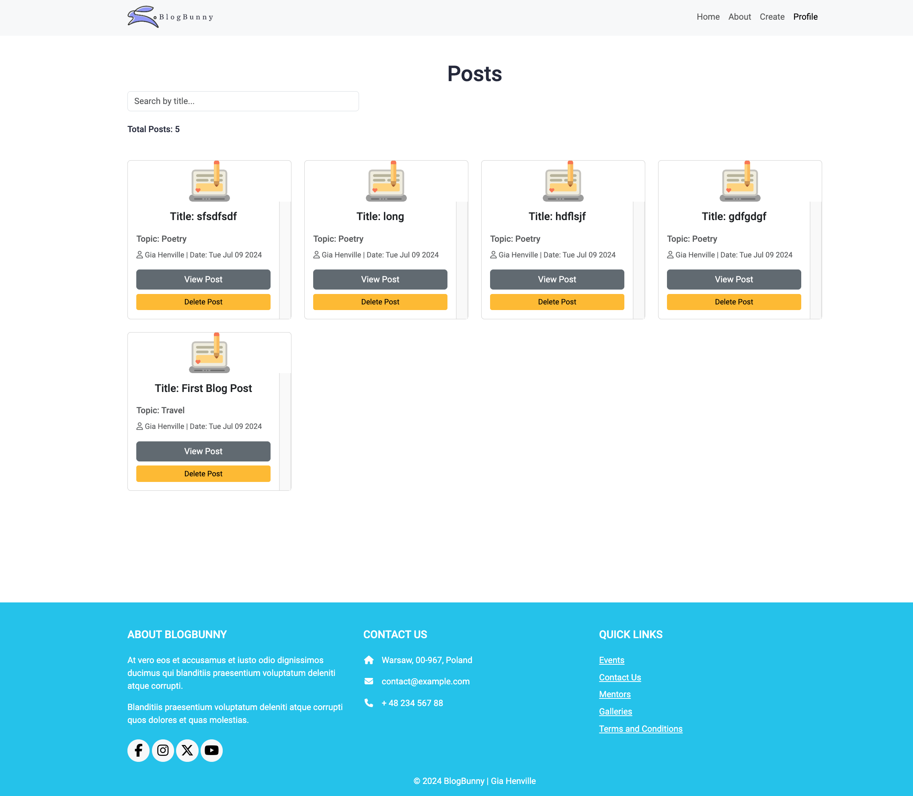
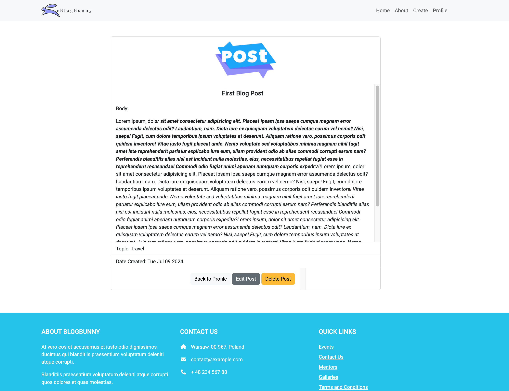
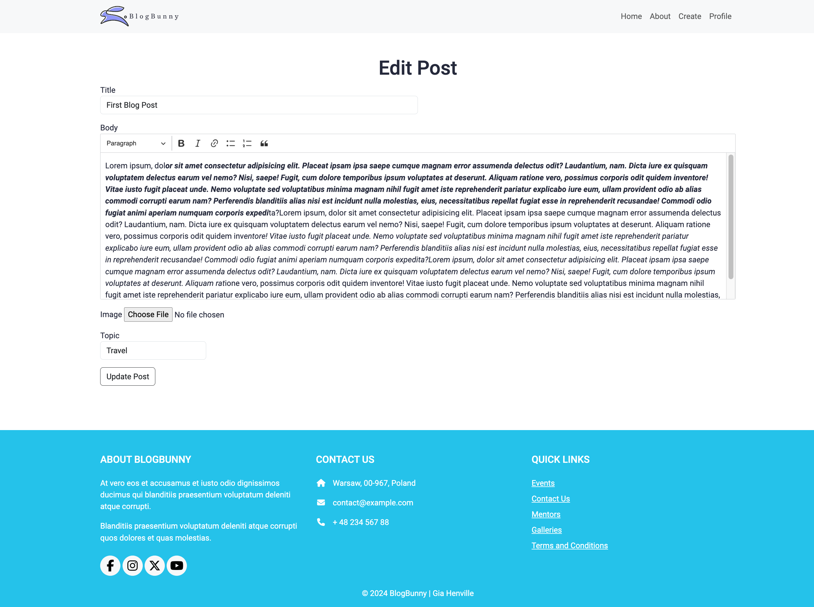
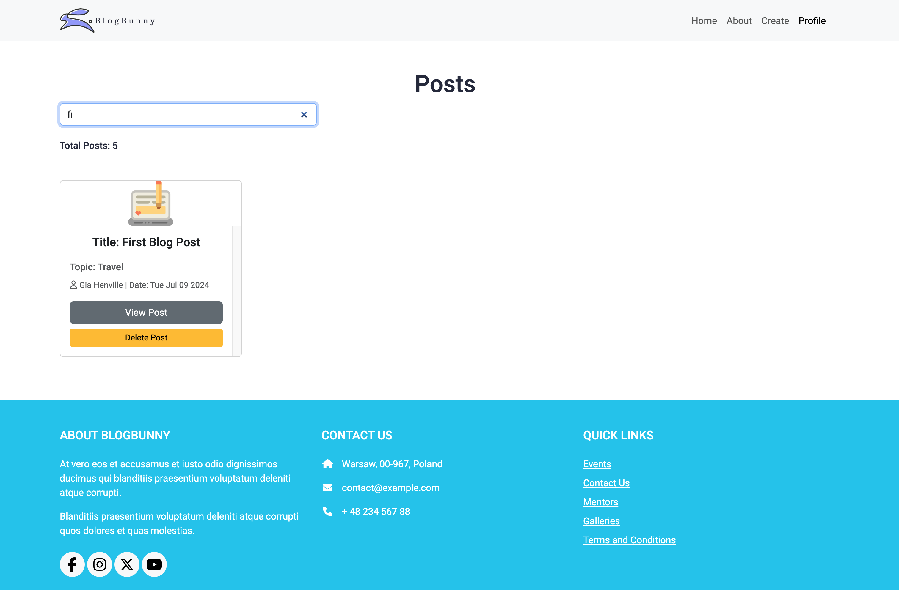

# Blog Web Application

[![View Demo Here!]](https://youtu.be/7mnrXczrBv8)

Hello! This is my Blog Web Application project. This is a fully responsive full-stack web app.  Users can create, edit, view, and delete their blog posts. There is also a search feature to quickly search through created posts. 

## Technologies Used
- **Backend**: Node.js, Express.js
- **Frontend**: EJS (Embedded JavaScript), jQuery
- **Styling**: CSS, Bootstrap
- **Middleware**: body-parser, uuid
- **Development**: nodemon

## Features
- **CRUD Operations**: Create, Read, Update, Delete posts.
- **Responsive Design**: Works seamlessly on any device, big or small.
- **Search Functionality**: Use the search bar to filter through your posts.
- **Organized Structure**: Organized files neatly into folders like `public` for assets and `views` for EJS templates.
- **Partials**: Headers and footers are reusable thanks to EJS partials.
- **Automatic Server Refresh**: Nodemon keeps an eye on file changes and restart the server automatically.

