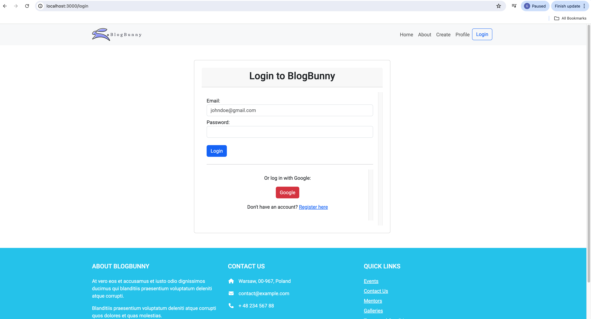
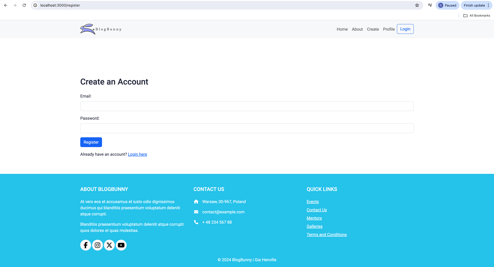

# Blog Web Application

## [![View Demo on YouTube Here!]](https://youtu.be/eoRHVAaXCSg)

Hello! Welcome to my Blog Web Application project. This fully responsive full-stack app allows users to log in and manage their blog posts—creating, editing, viewing, and deleting them with ease. User credentials and blog posts are securely stored in a database, ensuring that all information persists across login and logout sessions. To protect user data, passwords are hashed using bcrypt and further secured with multiple rounds of salting, providing robust defense against hacking attempts, even for common passwords. Additionally, the app features a search function to quickly filter and find specific posts.

## Technologies Used
- **Backend**: Node.js, Express.js
- **Frontend**: EJS (Embedded JavaScript), jQuery
- **Styling**: CSS, Bootstrap
- **Middleware**: body-parser, passport
- **Development**: nodemon
- **Database**: PostgreSQL (for storing user credentials and posts)
- **OAuth**: Google OAuth 2.0 (for user authentication)
- **Password Security**: bcrypt (for hashing and securing user passwords)

## Features
- **CRUD Operations**: Create, Read, Update, Delete posts.
- **Responsive Design**: Works seamlessly on any device, big or small.
- **Search Functionality**: Use the search bar to filter through your posts.
- **Organized Structure**: Organized files neatly into folders like `public` for assets and `views` for EJS templates.
- **Partials**: Headers and footers are reusable thanks to EJS partials.
- **Automatic Server Refresh**: Nodemon keeps an eye on file changes and restarts the server automatically.
- **Environment Variables**: Secured important development information using environment variables to prevent exposure of sensitive data.
- **Database Integration**: Added a database to store user credentials and posts, ensuring data persistence and security.
- **Google OAuth**: Users can sign in using their Google accounts for a seamless and secure authentication experience.
- **User Registration**: Users can register an account with their email and password, allowing them to log in and manage their blog posts.
- **Local Sign-In**: Added support for local user sign-in with email and password.
- **Password Security**: User passwords are securely hashed and stored using bcrypt, with rounds of salting to further protect against hacking attempts.
- **User Authentication**: Implemented user authentication using Passport, enabling secure login and session management.

